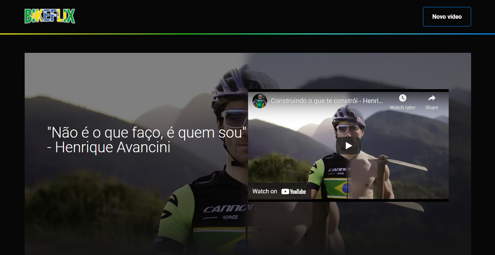

<div align="center">
  
</div>

## Bikeflix

[](https://github.com/Klayverx)
[](#)
[](https://reactjs.org)

<h4 align="center">
  Bikeflix é uma aplicação para armazenamento de vídeos de ciclismo separado em categorias.
</h4>



## 🧪 Tecnologias
<div align="center">
  <br />
  
</div>

Este projeto foi desenvolvido usando as seguintes tecnologias:

- [React](https://reactjs.org)
- [Styled Components](https://styled-components.com/)

## 👨🏽‍💻 Inicialização local

**No terminal, clone o projeto e acesse a pasta da aplicação**

```bash
$ git clone https://github.com/Klayverx/bikeflix.git && cd bikeflix
```

**Siga os passos abaixo:**
```bash
# Instalar as dependências
$ npm install
# Iniciar o front-end
$ npm dev
```

A aplicação poderá ser acessada localmente em `http://localhost:3000`
